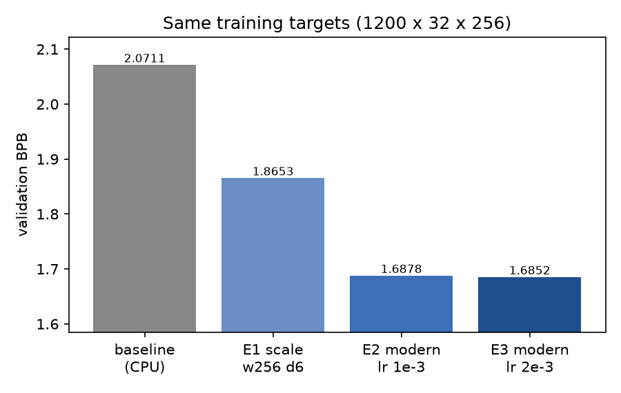
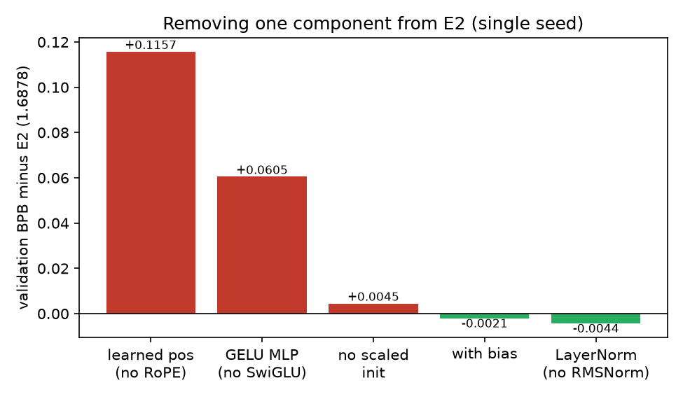
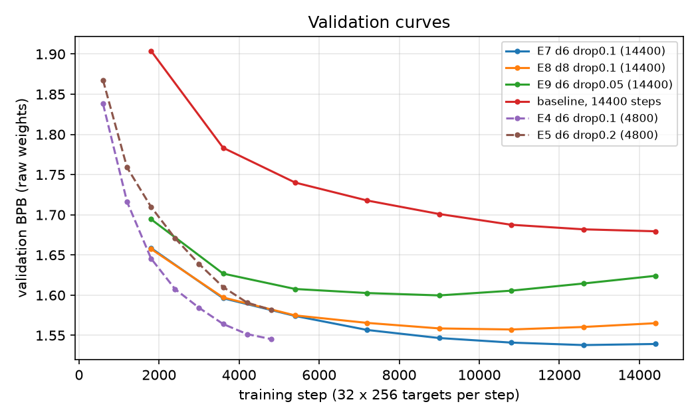
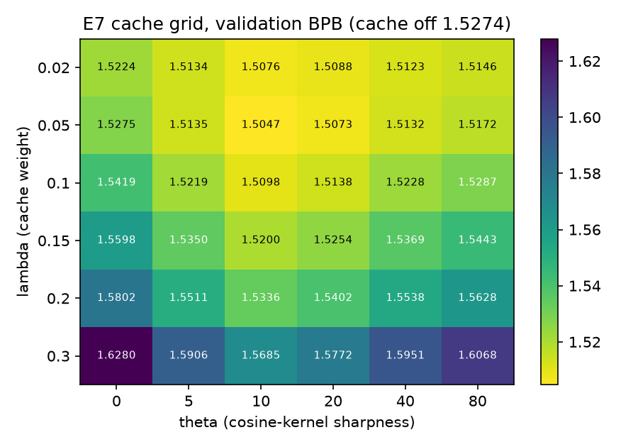
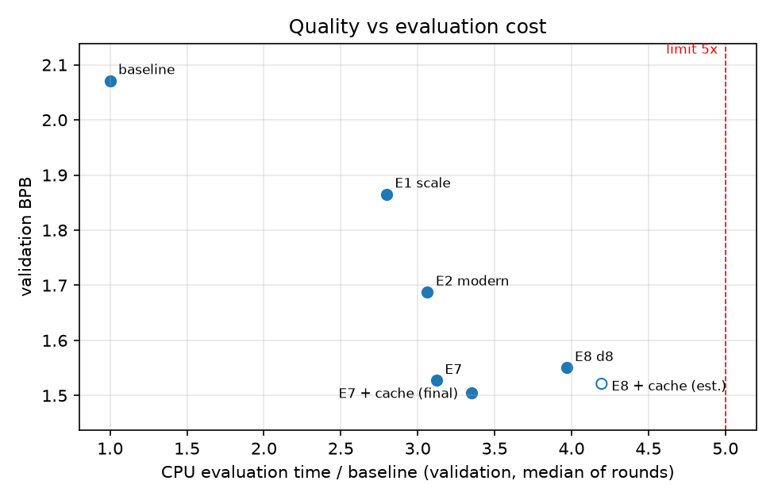

# MP1 Report: Modern Architecture, Longer Regularised Training and a Within-Window Neural Cache for a Small GPT on WikiText-2

**Author:** Zhu Wenkang (student ID 3036843630, GitHub `zwkcyy`) · HKU DASE7506 · September 2026
**Code:** https://github.com/zwkcyy/dase7506-mp1 · **Checkpoint:** release `v1.0`

---

## Abstract

I train a 5.3M-parameter GPT from scratch on WikiText-2 (BPE-2048) and evaluate it with the unmodified course evaluator. The final predictor has three parts. The first is a modernised architecture: rotary position embeddings (RoPE), SwiGLU feed-forward blocks, RMSNorm, no linear biases and scaled residual initialisation. The second is a longer training recipe with dropout 0.1 and an exponential moving average (EMA) of the weights. The third, the core mechanism, is a strictly causal within-window neural cache that mixes the model's distribution with a copy distribution. The copy distribution is built from earlier tokens in the same 256-token window and weighted by hidden-state similarity. The final predictor reaches **1.5198 test BPB**, against 2.1013 for the official baseline, at **3.33×** the baseline's CPU scoring time, 1.84 GiB peak RAM and a 20.4 MiB checkpoint. Controlled experiments show three things. First, at the baseline's training budget the architecture alone improves validation BPB by 0.18 over a plain-scaled model of the same size, and RoPE and SwiGLU account for almost all of this. Second, training the baseline architecture for 12× longer does not close the gap, so the gain is not just more training. Third, the cache improves validation BPB by 0.021–0.029 on three different checkpoints, and the improvement disappears when its similarity kernel is replaced by uniform copying.

## 1. Task and setting

The task is next-token prediction on the supplied WikiText-2 text with a fixed BPE tokenizer (vocabulary 2048). The evaluator splits the test text into independent, non-overlapping 256-token causal windows. It reports bits per byte (BPB): the total negative log-likelihood in bits divided by the number of UTF-8 bytes. The test split has 428,405 targets and 1,292,013 bytes, so test BPB ≈ 0.478 × the mean token loss in nats.

The constraints shape every design decision here. Evaluation must stay within **5× the baseline's CPU scoring time**, **4 GiB peak RAM** and **64 MiB of inference assets**. Data, tokenizer and evaluator must stay unchanged. Selection must use the validation split only. No state may pass between windows. Training time is unrestricted. The training split contains only about 3.6M tokens, so data, not compute, is the scarce resource.

The official baseline is a GPT-2-style model: width 128, 4 layers, 4 heads, learned absolute positions, LayerNorm, GELU MLP, tied embeddings, 1.09M parameters. It is trained for 1,200 steps × 32 × 256 = 9.83M targets, about 2.7 epochs. I reproduced it exactly on CPU and obtained **2.0711 validation / 2.1013 test BPB**.

## 2. Diagnosis of the baseline

I identified four limitations, each addressed by one part of the method.

1. **Capacity is far below the evaluation budget.** The baseline uses 1× of a 5× time budget. A width-256, 6-layer model scores at about 3× baseline time, so capacity can grow roughly fivefold within the limit.
2. **The model is undertrained.** 2.7 epochs at a peak learning rate of 1e-3 leaves the validation loss still falling steeply.
3. **Weak positional inductive bias.** The baseline must learn 256 absolute position vectors from a small corpus, and positional information is added directly into the residual stream.
4. **No explicit copy mechanism.** Wikipedia text repeats names and terms within a paragraph. A small model cannot store many rare entities in its parameters, but these entities often appeared earlier in the same window.

## 3. Method

### 3.1 Configurable model

All models come from one class in `student.py`. With only the five baseline keys it reproduces `model.GPT` exactly: the modules are created in the same order, so the random initialisation is identical, and the maximum output difference is 0.0. Unknown configuration keys raise an error, so a mistyped option cannot be silently ignored. Every ablation therefore changes exactly one configuration key.

The final architecture has width 256, 6 layers, 4 heads (head dimension 64), context 256, tied input and output embeddings, and 5,344,512 parameters. Its components are:

- **RoPE** (Su et al., 2021). Queries and keys are rotated pairwise by angles proportional to position, so attention scores depend only on relative offsets. The rotation tables are computed, not stored, so they add nothing to the checkpoint.
- **SwiGLU** (Shazeer, 2020). The feed-forward block is $W_{\text{down}}\,(\text{SiLU}(W_g x) \odot W_v x)$ with hidden size 704 (≈ 8/3 × 256). This keeps the parameter count close to a 4× GELU MLP (541k vs 524k per block).
- **RMSNorm** (Zhang & Sennrich, 2019) in a pre-norm residual layout, and **no biases** in linear layers.
- **Scaled initialisation.** The output projections of attention and MLP, which write into the residual stream, are initialised with standard deviation $0.02/\sqrt{2\cdot\text{depth}}$ (Radford et al., 2019).
- **Dropout** on the embedding output and on each residual branch, active only in training mode.

### 3.2 Training recipe

`train.py` keeps the original recipe as its default (verified to produce an identical loss, BPB and checkpoint hash after 100 steps) and adds options. The final recipe is AdamW (weight decay 0.1 on all parameters), peak learning rate 2e-3, 100 warm-up steps, cosine decay to 10% of peak, gradient clipping at 1.0, batch 32 × 256, dropout 0.1 and **14,400 steps** (117.96M targets, about 33 epochs).

I also keep an **EMA of the weights** with decay $\min(0.999, (s+1)/(s+10))$ at step $s$. The short initial decay stops the average from keeping the random initialisation, and the final decay averages over roughly the last 1,000 steps (Polyak & Juditsky, 1992). The saved checkpoint holds the EMA weights. At the end of every run the raw weights are scored as well, which gives a free EMA ablation.

### 3.3 Core mechanism: within-window neural cache

Following the continuous cache of Grave et al. (2017), and in the spirit of pointer-sentinel models on this dataset (Merity et al., 2016), evaluation-time predictions are

$$p(w \mid x_{\le t}) = (1-\lambda)\,p_{\text{model}}(w \mid x_{\le t}) + \lambda\,p_{\text{cache}}(w \mid x_{\le t}),$$

$$p_{\text{cache}}(w \mid x_{\le t}) = \sum_{i<t,\;x_{i+1}=w} \operatorname{softmax}_i\!\big(\theta \cos(h_t, h_i)\big),$$

where $h$ are the final normalised hidden states of the same window. $h_i$ is the state that predicted $x_{i+1}$. If the current state resembles it, the current context resembles that earlier context, and $x_{i+1}$ becomes a likely continuation. $\lambda$ sets the cache weight and $\theta$ the sharpness of the similarity kernel. $\theta = 0$ reduces the cache to uniform copying of all earlier tokens.

**Causality and validity.** Position $t$ uses its own query $h_t$, keys $h_i$ with $i < t$, and values $x_{i+1}$ with $i+1 \le t$. All of these depend only on `ids[:, :t+1]`. Position 0 has no history and uses $p_{\text{model}}$ alone. Both parts of the mixture are normalised distributions, so the result sums to one. Nothing is stored between calls. The course contract tests and my extra checks (`check_config.py`, run with the cache on) confirm causality, normalisation, batch independence and the absence of carried state.

**Sparse exact implementation.** My first implementation built a dense 2048-way cache distribution at every position and applied `log`/`logaddexp` over the whole vocabulary. That work falls on 32 × 256 × 2048 ≈ 16.8M elements per batch, several times over. But a token that has not appeared earlier in the window has zero cache probability. Its mixed probability is exactly $(1-\lambda)\,p_{\text{model}}$, a constant shift of $\log(1-\lambda)$ in log space. The final implementation applies this shift once. It then recomputes only the at most 255 tokens seen in the window, using a token-equality matrix to add up the weights of repeated tokens. Against the dense version, it agrees to within 8.6e-6 (fp32 rounding) on randomised tests and to within 9e-12 in validation BPB. The cache's extra scoring time falls from about 1.3× (dense version, measured only in the unstable session) to **0.23×** baseline time.

**Tuning.** $\lambda$ and $\theta$ are selected on the validation split for a trained checkpoint and written into its configuration, so the evaluator rebuilds the cached predictor with no extra files.

## 4. Experimental protocol

- **Selection:** every choice (architecture, learning rate, dropout, depth, cache parameters, final model) used validation BPB only. I wrote the selection rules down before looking at the candidates, e.g. prefer the cheaper model if two differ by less than 0.003. The test split was evaluated **once**, after the code was frozen at commit `fb51697`.
- **Hardware:** Intel Core i5-9300HF (4 cores), NVIDIA GTX 1650 (4 GB), Windows 11. GPU training used fp32, because on this GPU `bf16` is emulated and slower (107.5 s vs 72.2 s for the baseline recipe).
- **Seed:** 17 for every run. Each configuration was run with one seed, so differences below about 0.005 BPB cannot be told apart from noise (Section 7).
- **Resource measurement (`measure.py`):** the unmodified `evaluate.py` runs on CPU in fp32 with 4 threads. Baseline and candidate alternate within one session. The reported figure is the median of per-round time ratios, so slow drift in machine speed cancels out. Peak RAM is the summed RSS of the whole evaluation process tree, polled every 20 ms. On Windows the venv's `python.exe` is only a launcher, so measuring the launcher alone would report about 5 MB. Measurements taken in an unstable environment (Balanced power mode) were repeated in a stable one, except the superseded dense cache (§3.3).

## 5. Results

### 5.1 Equal training budget (9.83M targets, same as the baseline)

| Run | Model | Params | Val BPB | Δ vs previous row | GPU train (s) | Eval time ratio |
|---|---|---|---|---|---|---|
| Baseline | w128 d4, original | 1.09M | 2.0711 | — | 72 | 1.00 |
| E1 | w256 d6, baseline architecture | 5.33M | 1.8653 | −0.206 | 242 | 2.80 |
| E2 | w256 d6, modern architecture | 5.34M | 1.6878 | −0.178 | 306 | 3.06 |
| E3 | as E2, lr 2e-3 | 5.34M | 1.6852 | −0.003 | 306 | 3.06 |

*Figure 1: validation BPB at the baseline's training budget (baseline, E1, E2, E3).*

At the same number of processed targets, scaling alone gains 0.21 BPB. The architecture then gains another 0.18 at an almost identical parameter count (E1 vs E2), which isolates the effect of the architecture from that of size. Raising the learning rate matters little (0.003), so the optimiser was not the bottleneck.

### 5.2 Component ablations (E2 settings, one component reverted at a time)

| Reverted component | Val BPB | Δ vs E2 (1.6878) |
|---|---|---|
| RoPE → learned absolute positions | 1.8034 | **+0.116** |
| SwiGLU → GELU MLP | 1.7482 | **+0.060** |
| scaled init → plain init | 1.6922 | +0.004 |
| no bias → with bias | 1.6856 | −0.002 |
| RMSNorm → LayerNorm | 1.6834 | −0.004 |

*Figure 2: change in validation BPB when one component is reverted from E2 (single seed).*

RoPE and SwiGLU account for almost the whole architectural gain. The GELU variant has about 2% fewer parameters, which is too small a gap to explain a 0.06 difference. A plausible reading of the RoPE result is that it builds in a relative-position prior ("the token three positions back") that would otherwise have to be learned from scarce data. It also keeps position information out of the residual stream. The experiment demonstrates the effect, not this mechanism. Scaled initialisation helps slightly. **RMSNorm and removing biases show no benefit.** Their differences are within single-seed noise. I kept them as standard choices and do not claim any gain from them.

### 5.3 Training length and regularisation

| Run | Steps | Dropout | Val BPB (EMA) | Val BPB (raw) | EMA gain |
|---|---|---|---|---|---|
| E4 | 4,800 | 0.1 | 1.5393 | 1.5453 | 0.006 |
| E5 | 4,800 | 0.2 | 1.5816 | 1.5818 | 0.000 |
| **E7** | **14,400** | **0.1** | **1.5274** | 1.5392 | 0.012 |
| E9 | 14,400 | 0.05 | 1.6043 | 1.6240 | 0.020 |
| Baseline architecture, long | 14,400 | 0 | 1.6795 | — | — |

All modern runs use w256 d6, lr 2e-3 and EMA 0.999.

*Figure 3: validation BPB (raw weights) during training for E4, E5, E7, E8, E9 and the long baseline run.*

The curves show a clear pattern. At 4,800 steps both runs were still improving, and the stronger dropout (0.2) was worse. The model was short of training, not overfitting. At 14,400 steps, dropout 0.1 (E7) flattens after about 12,600 steps, from 1.5379 to 1.5392 on the raw weights. Dropout 0.05 (E9) reaches its minimum at 9,000 steps (1.5997) and then clearly overfits. Dropout 0.1 therefore sits between too much and too little regularisation for this data size.

EMA helps more as overfitting grows: 0.000 for E5, 0.006–0.012 for E4/E7, 0.015–0.020 for the overfitting E8/E9 runs. One explanation is that the average lags behind the current weights, so it pulls the model back towards earlier, less overfitted states. This is an observation over five runs, not a proof.

**Is the gain just more training?** No. The baseline architecture trained for the same 117.96M targets as E7 reaches only 1.6795. That is just 0.008 better than the modern architecture trained on 12× fewer targets (E2, 1.6878), which also used less GPU time (306 s vs 892 s). It is 0.15 worse than E7 at the same budget.

### 5.4 A failed direction: more depth

The remaining time budget allowed 8 layers (6.95M parameters, 3.97× scoring time). E8 used E7's recipe and reached only **1.5506** (raw 1.5651). Its validation curve bottoms out at 10,800 steps (1.5573) and then rises. With 3.6M training tokens, the extra capacity mostly adds overfitting, even with dropout and EMA. Depth was therefore not the binding constraint. Data was.

### 5.5 Core mechanism ablation: the neural cache

Validation BPB of E7 with the cache, over λ (rows) and θ (columns).

*Figure 4: E7 validation BPB over the cache grid (λ rows, θ columns; cache off 1.5274).*

| λ \ θ | 0 | 5 | 10 | 20 | 40 | 80 |
|---|---|---|---|---|---|---|
| 0 (off) | 1.5274 | | | | | |
| 0.02 | 1.5224 | 1.5134 | 1.5076 | 1.5088 | 1.5123 | 1.5146 |
| 0.05 | 1.5275 | 1.5135 | **1.5047** | 1.5073 | 1.5132 | 1.5172 |
| 0.10 | 1.5419 | 1.5219 | 1.5098 | 1.5138 | 1.5228 | 1.5287 |
| 0.15 | 1.5598 | 1.5350 | 1.5200 | 1.5254 | 1.5369 | 1.5443 |
| 0.20 | 1.5802 | 1.5511 | 1.5336 | 1.5402 | 1.5538 | 1.5628 |
| 0.30 | 1.6280 | 1.5906 | 1.5685 | 1.5772 | 1.5951 | 1.6068 |

Summary on three checkpoints (E7 and E8: best of a finer grid λ ∈ {0.03…0.07} × θ ∈ {7, 10, 14}; E4: coarse grid):

| Checkpoint | Cache off | Uniform copy (λ 0.05, θ 0) | Best (λ 0.05, θ 10) | Gain |
|---|---|---|---|---|
| E4 | 1.5393 | 1.5428 | 1.5184 | 0.021 |
| E7 | 1.5274 | 1.5275 | 1.5047 | 0.023 |
| E8 | 1.5506 | 1.5470 | 1.5213 | 0.029 |

Four findings stand out:

1. **The similarity kernel is what matters.** Uniform copying (θ = 0, λ = 0.05) changes BPB by −0.004 to +0.004 across the three checkpoints. Similarity-weighted copying gains 0.021–0.029. So the cache helps by retrieving *contextually matching* earlier positions, not by boosting tokens that appeared recently.
2. **The optimal cache weight is small (λ = 0.05).** Attention already performs most copying, and the cache acts as a correction. Larger λ lets cache noise override the model.
3. **Moderate sharpness is best.** θ = 10 beats both softer (5) and sharper (40, 80) kernels. A very sharp kernel commits to a single match and becomes overconfident when that match is wrong.
4. **The effect is robust.** The optimum is the same (λ = 0.05, θ = 10) on all three checkpoints, which differ in training length and depth.

The cache's gain is measured on **validation** only. The test split was scored once, for the final predictor, so I report no test-set gain for the cache.

### 5.6 Final predictor

The final predictor is E7 (EMA weights) plus the cache at λ = 0.05, θ = 10. It was chosen over E8 plus cache (1.5213) by validation BPB (1.5047).

| Metric | Value | Limit |
|---|---|---|
| **Test BPB** | **1.5198** (baseline 2.1013) | — |
| CPU scoring time / baseline (test, median of 5 alternating rounds) | 3.33 (49.7 s vs 14.9 s) | ≤ 5 |
| Peak RAM (whole process tree) | 1.84 GiB | ≤ 4 GiB |
| Checkpoint | 20.4 MiB | ≤ 64 MiB |

About 1.8 GiB of the peak RAM is evaluator overhead that every model shares. The evaluator tokenises all three splits, and it uses the same memory with the baseline checkpoint.

## 6. Prediction quality vs computational cost

*Figure 5: validation BPB against scoring-time ratio (the E8 + cache time is estimated, hollow marker).*

| Change | Val BPB gain | Extra scoring time (× baseline) | Extra training cost |
|---|---|---|---|
| Scale to w256 d6 (E1) | 0.206 | +1.80 | 3.3× GPU time per step |
| Modern architecture (E2 vs E1) | 0.178 | +0.27 | +27% per step |
| 12× training + dropout + EMA (E7 vs E3) | 0.158 | 0 | 12× steps (≈ 62 min) |
| Cache (E7 + cache vs E7) | 0.023 | +0.23 | none (53 validation passes) |
| 8 layers (E8 vs E7) | −0.023 | +0.85 | +33% per step |

The architecture is the most efficient change: it costs 0.27× in scoring time for 0.18 BPB. Longer training is free at evaluation time but costs an hour of GPU time. The cache has the worst gain per unit of scoring time, but it needs no training, and its cost depends strongly on implementation (≈ 1.3× dense in the unstable session vs 0.23× sparse, for identical outputs). Depth was the only change that added cost and made results worse.

**Total cost:** about 5.1 GPU-hours of training across all completed runs (including the short smoke and timing runs), 14 minutes of CPU training for the official baseline plus 2 minutes for two 100-step check runs, one killed run of about 10 minutes, and about 2 hours of CPU timing measurements. The final model's own training took 62.5 minutes on the GTX 1650.

## 7. Critical analysis and limitations

- **Single seed.** Every configuration was run once. The large effects (scale, RoPE, SwiGLU, training length, cache) are 4–40× larger than the plausible seed noise. The small ones (RMSNorm, biases, the E2/E3 learning-rate difference) are not distinguishable from noise and are reported as such.
- **The cache is not learned.** λ and θ are fixed after training, and the hidden states were trained for prediction, not retrieval. A learned gate trained jointly with the model, as in pointer-sentinel mixtures, could weight the cache per position and would likely use it better. The window limit also means that early positions in every window have little or no history. Measuring the cache's gain as a function of position would quantify this. I did not run that analysis.
- **Data is the binding constraint.** The failures of E8 (depth) and E9 (weaker dropout) both come from overfitting 3.6M tokens. Further gains would more likely come from better regularisation or sample efficiency than from capacity. Examples are decaying only the weight matrices (implemented as `--decay-2d-only` but never tested), longer schedules with stronger dropout, or keeping the best checkpoint by validation.
- **Selection by the final checkpoint only.** E7's raw weights were slightly better at step 12,600 than at 14,400, but no intermediate checkpoints were saved. EMA partly compensates.
- **Reproducibility.** Training used CUDA kernels that are not bit-for-bit deterministic, so retraining may change the last digits of BPB. The released checkpoint (SHA256 `b1a16def…15da0b`) is the reference, and evaluation from it is deterministic on CPU.
- **Hardware-specific timing.** Scoring-time ratios were measured on one laptop CPU. The alternating protocol reduces drift, but ratios may differ somewhat on other machines. The final ratio (3.33) leaves a wide margin below the limit of 5.

## 8. Conclusion

Within a strict evaluation budget and a very small dataset, the largest gains came from two sources. The first was a better inductive bias, above all relative positions (RoPE) and gated MLPs (SwiGLU). The second was training long enough with just enough regularisation (dropout 0.1, EMA). A strictly causal within-window cache added a smaller but consistent improvement, and it disappears when its similarity kernel is removed. The final predictor reaches 1.5198 test BPB (−0.58 vs baseline) at 3.33× baseline scoring time. The negative results (depth, weaker dropout, RMSNorm and biases) point to data, not capacity, as the remaining bottleneck.

## Disclosure

**Reused work:** the course starter code (baseline model, training loop, evaluator, data, tokenizer), and the published methods cited below. **AI assistance:** Claude (Anthropic, claude.ai) helped design the plan and experiments, wrote first versions of the model, training options, cache and measurement code, and helped interpret results and draft this report. Claude Code (Anthropic) ran the experiments on my machine and kept the logs. The full statement is in the repository README. All numbers come from the logged runs in `results/`.

## References

- Grave, E., Joulin, A., Usunier, N. (2017). Improving Neural Language Models with a Continuous Cache. *ICLR*.
- Merity, S., Xiong, C., Bradbury, J., Socher, R. (2016). Pointer Sentinel Mixture Models. *arXiv:1609.07843*.
- Polyak, B. T., Juditsky, A. B. (1992). Acceleration of Stochastic Approximation by Averaging. *SIAM J. Control and Optimization*.
- Radford, A., Wu, J., Child, R., Luan, D., Amodei, D., Sutskever, I. (2019). Language Models are Unsupervised Multitask Learners. *OpenAI technical report*.
- Shazeer, N. (2020). GLU Variants Improve Transformer. *arXiv:2002.05202*.
- Su, J., Lu, Y., Pan, S., Murtadha, A., Wen, B., Liu, Y. (2021). RoFormer: Enhanced Transformer with Rotary Position Embedding. *arXiv:2104.09864*.
- Zhang, B., Sennrich, R. (2019). Root Mean Square Layer Normalization. *NeurIPS*.
